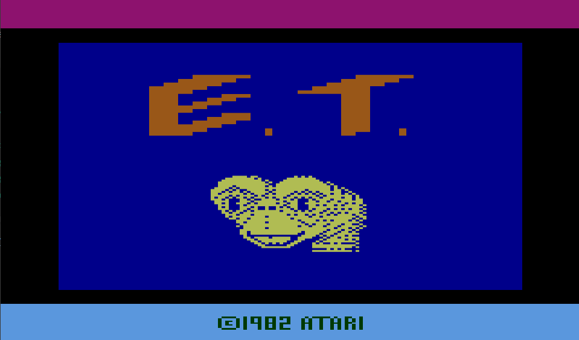
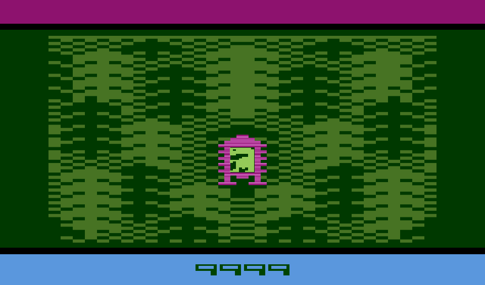

# 👽 E.T. THE EXTRA-TERRESTRIAL (ATARI 2600 🕹️)

🇺🇸 A faithful Python recreation of E.T. The Extra-Terrestrial for the Atari 2600.
This project is a small tribute to Howard Scott Warshaw, who had only six weeks to create the original game under intense pressure. Despite the harsh criticism it received, the story behind its development is fascinating. I wanted to revisit and honor that effort by recreating the game in Python.

🇫🇷 Reproduction fidèle en Python du jeu E.T. The Extra-Terrestrial sur Atari 2600.
Ce projet est un petit hommage à Howard Scott Warshaw, qui n’a eu que six semaines pour développer le jeu original dans des conditions très difficiles. Malgré les critiques, l’histoire derrière ce jeu est passionnante. J’ai voulu revisiter et saluer cet effort en le recréant en Python.

---

## ©️ Credits / Crédits

| Role                 | Name                 |
| -------------------- | -------------------- |
| Original Game        | Atari, Inc. (1982)   |
| Designer             | Howard Scott Warshaw |
| Artist               | Jerome Domurat       |
| Python Remake Author | Yann W.              |

---

## 📸 E.T. 👽 Preview

### Title



### Forest



### Pit


---

## 🚀 Installation & Usage

1️⃣ **Download or Clone the Project**

-   **Manual Download**:
    1. Click on the **Code** button at the top of the GitHub page.
    2. Select **Download ZIP** and extract the folder on your PC.
-   **Using Git (optional)**:

```bash
git clone https://github.com/YannWoj/et-atari2600-python.git
```

2️⃣ **Install Requirements**

Make sure you have Python 3.7+ installed, then install pygame:

```bash
pip install pygame
```

3️⃣ **Launch E.T.**

Navigate to the project folder and run:

```bash
python main.py
```

## 🎮 How to Play

### 🕹️ Controls

-   **Arrow Keys (←↑↓→)**: Move E.T. around
-   **SPACE**:
    -   Hold while moving → Run faster _(drains counter more)_
    -   Press while standing → Head raise animation
    -   **Special**: Press during pit fall → Levitate and avoid losing 269 points!

### 🎯 Game Mechanics

**Counter System**  
You start with **9999 points**. Each action reduces your counter:

-   Walking/Running: **-1 point** per step
-   Head raise: **-19 points**
-   Falling to pit bottom: **-269 points**

**Pit Escape**  
Use **SPACE** during a fall to trigger the head raise and levitate out of pits before hitting the bottom.

💡 _Survival Tip_: Time your head raise precisely during falls to save precious counter points!

[TO BE CONTINUED...]

### 🌲 Current Features

✅ Title screen with authentic Atari 2600 styling  
✅ Forest exploration with E.T. movement  
✅ Pit falling and levitation system  
✅ Counter system tracking all actions  
✅ Spaceship intro sequence  
✅ Sound effects and animations

[TO BE CONTINUED...]

## ⚠️ Disclaimer / Avertissement

🇺🇸 This project is an unofficial, fan-made recreation for educational and archival purposes only. All copyrights and trademarks related to E.T., Atari, and their respective content belong to their rightful owners.

🇫🇷 Ce projet est une reconstitution non officielle, réalisée par un fan à des fins éducatives et de préservation uniquement. Tous les droits d’auteur et marques déposées liés à E.T., Atari et leurs contenus respectifs appartiennent à leurs propriétaires.
